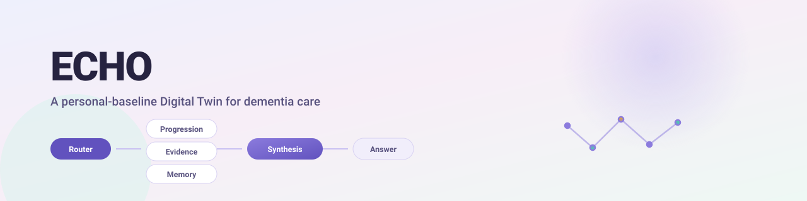
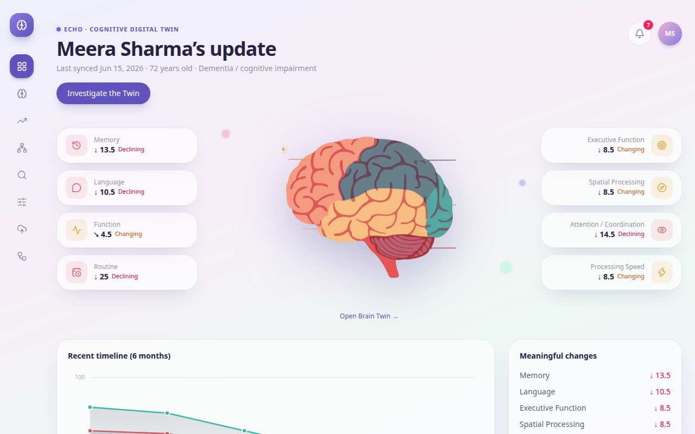
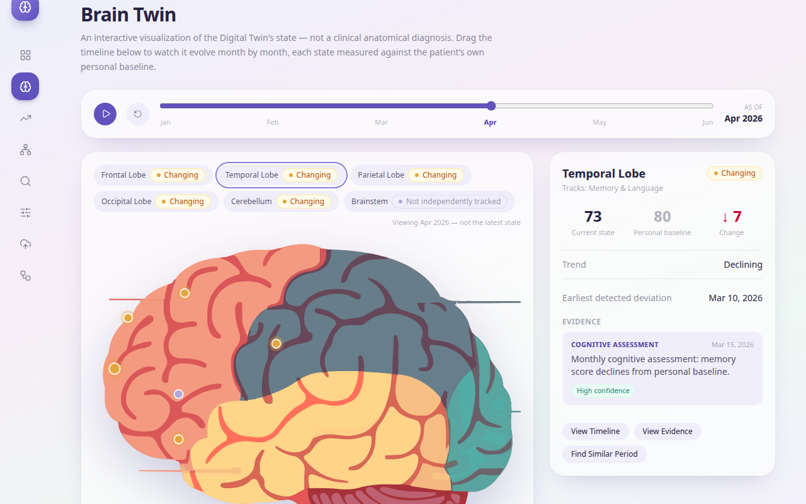
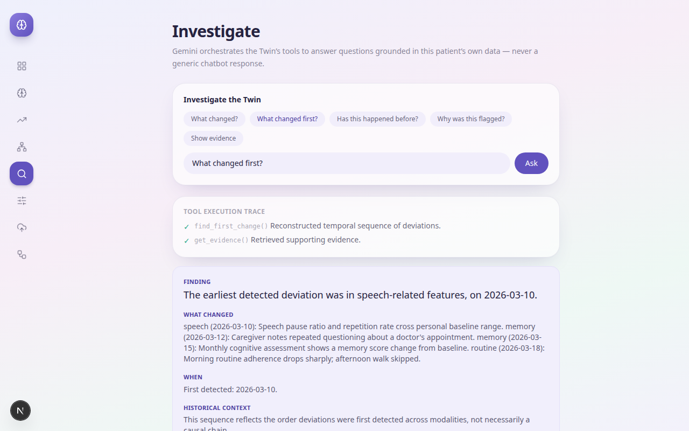
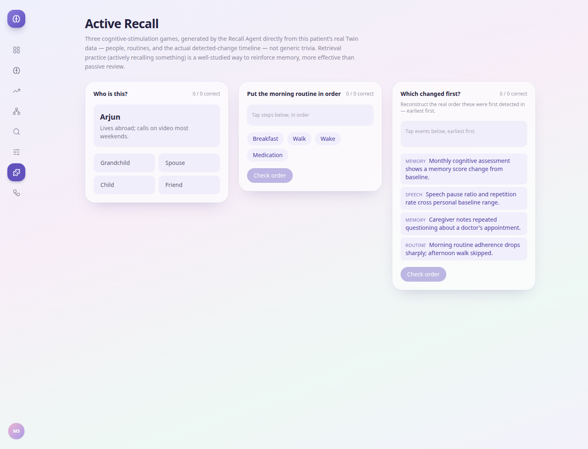
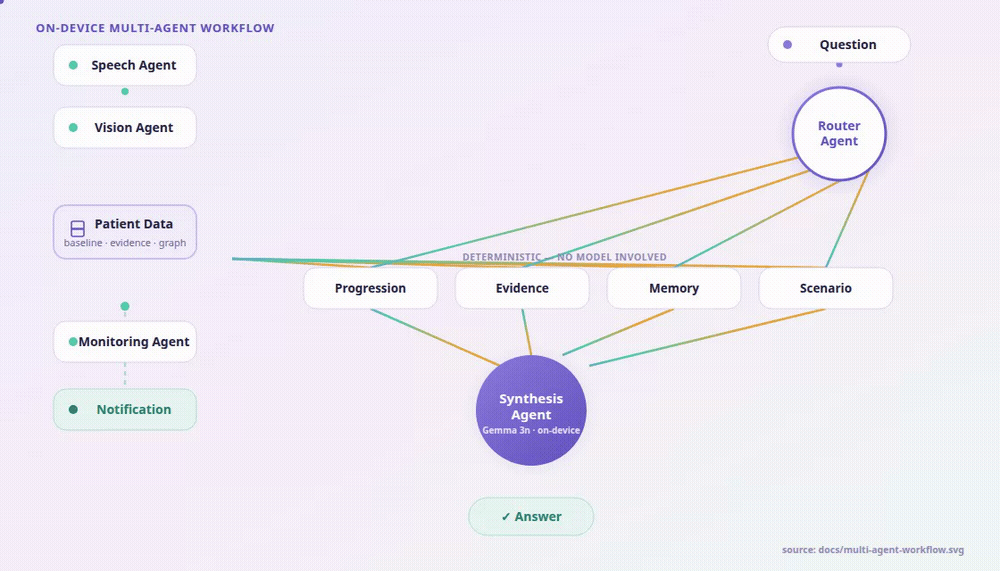
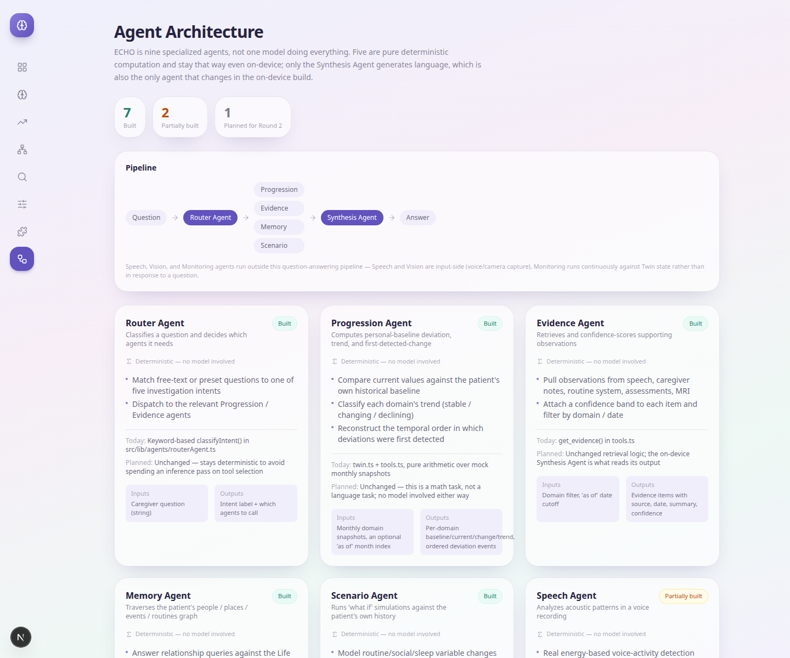

<p align="center">
  
</p>

<p align="center">
  
  
  
  
  
</p>

ECHO compares new observations against a person's own history — never a generic
population average — and explains **what changed, when it first changed, whether
it's happened before, and what a modeled "what if" scenario might look like.** It's
built around one synthetic demo patient (Meera Sharma, 72) with six months of mock
cognitive, speech, routine, caregiver, and imaging data.

It's more than a passive monitoring dashboard: alongside the caregiver-facing
analysis, three **active-recall mini-games** turn the same real Twin data — people,
routines, recent history — into retrieval-practice exercises for the patient, not
just charts for someone else to read.

The product experience and the ten-agent workflow are fully built and interactive.
The on-device model is intentionally mocked — a cloud call or a deterministic
template stand in for it — so the complete product can be evaluated before the
on-device build exists. See [What's built vs. what's a placeholder](#whats-built-vs-whats-a-placeholder)
for the honest breakdown.

## See it running

<p align="center">
  
</p>

<table>
<tr>
<td width="33%">

<p align="center"><sub>Brain Twin — scrub the timeline, state evolves month by month</sub></p>
</td>
<td width="33%">

<p align="center"><sub>Investigate — agents run, then a grounded answer is synthesized</sub></p>
</td>
<td width="33%">

<p align="center"><sub>Active Recall — three games, generated from real Twin data</sub></p>
</td>
</tr>
</table>

## Getting started

```bash
npm install
npm run dev
```

Open [http://localhost:3000](http://localhost:3000).

### Which LLM is ECHO using?

| | Today | On-device (planned) |
|---|---|---|
| **Model** | Google **Gemini** (`gemini-2.0-flash`) via `@google/generative-ai` — optional; a deterministic template is the default with no API key set | **Gemma 3n**, E2B variant, **INT4** quantized |
| **Runtime** | Cloud REST call | On-device, via the **MediaPipe LLM Inference API** |
| **Fallback** | Template built from the same structured data, fully offline | **Gemma 3 4B** via `llama.cpp` (GGUF, Q4_K_M) if the NPU delegate is unreliable on the target chipset |
| **Why this model** | Zero setup cost for a prototype | Natively multimodal (text/audio/image in one model instead of three separately-loaded ones) and its matryoshka architecture keeps INT4 memory small enough for phone RAM budgets — full reasoning in [`docs/ON_DEVICE_ARCHITECTURE.md`](docs/ON_DEVICE_ARCHITECTURE.md) |

To enable the live Gemini path instead of the offline template:

```bash
cp .env.local.example .env.local
# then set GEMINI_API_KEY in .env.local
```

No other code path changes — every other agent's output is identical either way;
only the Synthesis Agent's backend changes. That's deliberate: it's the same
swap-a-backend-behind-one-interface pattern the on-device build uses (see
`android-reference/app/.../agents/SynthesisEngine.kt`).

## Pages

| Route | What it shows |
| --- | --- |
| `/dashboard` | Current state summary, brain twin preview, recent 6-month trend, meaningful changes, a real notification bell |
| `/brain` | Interactive 2D brain twin with a Jan–Jun timeline scrubber — click a region for its baseline, current state, trend, and evidence "as of" whatever month is selected |
| `/progression` | Multi-domain trend chart with domain/range selectors, first-detected-change timeline, historical comparison |
| `/memory` | Interactive graph of the patient's people, places, events, routines, and stories (the "Life Twin") |
| `/investigate` | Ask the Twin a question (preset or free text); returns a tool-execution trace plus a sourced, structured answer |
| `/scenario` | "What if" simulator — adjust routine/social/sleep variables and see a modeled (not clinical) projection |
| `/recall` | Three active-recall mini-games generated by the Recall Agent from real Twin data — people & relationships, routine ordering, timeline ordering |
| `/architecture` | The agent roster below, rendered live — status, responsibilities, and today vs. planned backend for each agent |

## Architecture

ECHO is ten specialized agents, not one model doing everything. **Eight are pure
deterministic computation and stay that way even in the on-device build** — a
caregiver-facing tool that reports a memory score, runs a "what if" simulation, or
generates a recall-game round should give the same answer every time, never a
hallucinated one. Only the Synthesis Agent generates language, and it's the only
agent that changes on-device.

<p align="center">
  
  <br><sub>Source: <a href="docs/multi-agent-workflow.svg">docs/multi-agent-workflow.svg</a></sub>
</p>

Speech, Vision, Monitoring, and Recall agents run outside the question-answering
path itself — Speech and Vision are input-side capture, Monitoring runs
continuously in the background firing real notifications, and Recall generates its
own game rounds on demand at `/recall`. The question-answering path is:
**Question → Router Agent → the four deterministic tool agents (in parallel) →
Synthesis Agent → Answer.**

<p align="center">
  
</p>

| Agent | Status | Deterministic? | Today | Planned (on-device) |
|---|---|---|---|---|
| **Router** | Built | Yes | Keyword intent classification | Unchanged |
| **Progression** | Built | Yes | Baseline/trend arithmetic | Unchanged — it's math, not language |
| **Evidence** | Built | Yes | Retrieval + confidence scoring | Unchanged |
| **Memory** | Built | Yes | In-memory graph traversal | Same logic, real on-device store |
| **Scenario** | Built | Yes | Transparent heuristic simulation | Unchanged — stays non-generative on purpose |
| **Speech** | Partial | Yes today | Real Web Audio API acoustic analysis | Gemma 3n native audio input |
| **Vision** | Planned | No | Typed stub, throws on purpose | Gemma 3n native image input |
| **Monitoring** | Built | Yes | Real browser `Notification`, permission-gated | Native Android notification |
| **Recall** | Built | Yes | 3 mini-games generated from real Memory/Progression Agent data | Unchanged — same reasoning as Progression/Scenario |
| **Synthesis** | Partial | No | Cloud Gemini or deterministic template | **The swap point** — Gemma 3n (E2B, INT4) on-device |

This table is generated from, and must stay consistent with,
[`src/lib/agents/index.ts`](src/lib/agents/index.ts) — that file is the single
source of truth; it also drives the `/architecture` page directly, so this isn't
a documentation claim someone has to take on faith.

## What's built vs. what's a placeholder

**Genuinely built, not mocked:**
- Personal-baseline computation, trend detection, and the deviation timeline — real
  arithmetic over the mock dataset, not scripted output. Scrubbing the `/brain`
  timeline to January correctly shows every region as stable with "None detected
  yet"; deviations only appear at the actual dates they occur in the data.
- The Speech Agent's acoustic analysis — real signal processing via the Web Audio
  API, verified against a synthetic test file with known ground truth (a file
  designed with 50% silence measured a 0.49 pause ratio; 4 known tone-onsets over 4
  seconds measured exactly 60 activity-events/min).
- The Monitoring Agent's notification — a real, permission-gated browser
  `Notification`, triggered by the dashboard's bell button, not a cosmetic badge.
- The tool-execution trace on `/investigate` — genuinely reflects which agent
  functions ran, in order, for a given question.
- The three `/recall` games — every round and every correct answer is derived from
  the same real mock data the rest of the app reads (the Memory graph's actual
  relationships, the real routine step times, the Progression Agent's real
  first-detected-change events), not separately-authored trivia content.

**Intentionally a placeholder** (this is what the on-device build replaces, not a
defect):
- The Synthesis Agent's model backend — cloud Gemini or a deterministic template
  stand in for the on-device Gemma 3n call. Both read identical structured input;
  only the "writer" differs, which is exactly the interface the on-device build
  swaps behind.
- The Vision Agent — not implemented at all yet; a typed stub
  (`visionAgent.matchPhoto`) documents the intended contract without faking a
  working camera feature.

## On-device roadmap

**Primary on-device model: Gemma 3n (E2B, INT4)** via the MediaPipe LLM Inference
API. **Fallback: Gemma 3 4B** (GGUF, Q4_K_M) via `llama.cpp`. Both the reasoning and
the full feasibility register — memory, thermal, latency, storage, offline
survivability — are written up in
[`docs/ON_DEVICE_ARCHITECTURE.md`](docs/ON_DEVICE_ARCHITECTURE.md). A reference
Kotlin implementation of the swap-in (model loading, the synthesis call, a
graceful cloud/template fallback chain) is in
[`android-reference/`](android-reference/) — explicitly labeled as unverified,
written-but-not-yet-compiled code, not a working Android app.

## Code layout

```
src/
├── app/                    Next.js App Router pages + API routes
│   ├── architecture/       Live agent-roster page
│   ├── recall/              Three active-recall mini-games
│   ├── api/investigate/    POST → runs the agent pipeline + Synthesis Agent
│   └── api/simulate/       POST → runs the Scenario Agent
├── components/
│   └── recall/              PeopleRecallGame, RoutineRecallGame, TimelineRecallGame
└── lib/
    ├── mockData.ts         The synthetic patient dataset (single source of truth for data)
    ├── twin.ts             Personal-baseline + trend computation, with an "as of month" parameter
    ├── tools.ts             Underlying tool functions each agent wraps
    ├── gemini.ts            Question routing + Synthesis Agent (Gemini or template)
    ├── audioAnalysis.ts     Speech Agent's real Web Audio API DSP
    ├── types.ts             Shared TypeScript types
    └── agents/              Named agent layer — the single source of truth for the
                              roster above (index.ts), thin wrappers over the files
                              above (routerAgent.ts, progressionAgent.ts, recallAgent.ts, etc.)

android-reference/          Kotlin reference implementation for the on-device
                              Synthesis Agent (MediaPipe LLM Inference API / Gemma 3n).
                              NOT a working Android project — see its README for what's
                              verified vs. what still needs testing on real hardware.

docs/ON_DEVICE_ARCHITECTURE.md   The on-device model/quantization/feasibility reasoning.
```

**The brain visualization** (`public/brain-lobes-interactive.svg`) is a real
interactive SVG: every path carries a `data-region` attribute, and `BrainTwin.tsx`
attaches a click handler in React (the SVG's own embedded `<script>` doesn't run,
since browsers block scripts injected via `innerHTML`). Region status dots persist
across re-renders and transition color/size smoothly via CSS, which is what makes
the `/brain` timeline scrubber's month-by-month animation work.

**Personal baseline, not population norms:** every domain's "baseline" is computed
from that patient's own earliest recorded months, and every comparison downstream
(brain region color, chart trend lines, investigation findings) is relative to that
baseline — this is the core premise of the product, not just a dashboard feature.

## Tech stack

- Next.js 16 (App Router), React 19, TypeScript
- Tailwind CSS v4
- `@google/generative-ai` (Gemini) for the Synthesis Agent's optional cloud backend
- `lucide-react` for icons
- No database — all data lives in `src/lib/mockData.ts` for this prototype

## What's not built yet

- The on-device Synthesis Agent itself — `android-reference/` is a reference
  implementation, not a compiled, tested Android app
- The Vision Agent / Memory Bridge camera feature
- Real ASR/transcription in the Speech Agent (the acoustic DSP is real; transcription is not)
- Persistent storage (PostgreSQL, Neo4j, pgvector) — everything is in-memory mock data
- Multiple patients, auth, and role-based views (patient / caregiver / clinician)
- Twin versioning / update pipeline from new incoming data
- Installable/offline packaging (PWA or native) — currently a standard hosted web app,
  which will not survive an offline constraint as-is; see
  `docs/ON_DEVICE_ARCHITECTURE.md` §6

## Disclaimer

All patient data is synthetic and generated for demonstration purposes. ECHO is not
a diagnostic system and does not provide medical advice.
